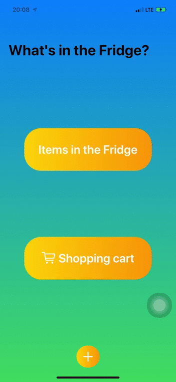
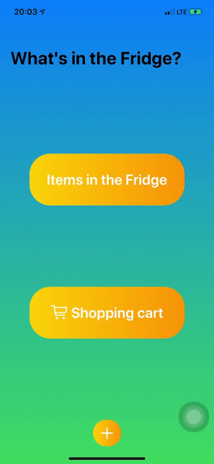

<h1> WiTF - What's in the Fridge </h1> 

 
This is a "What's in the Fridge" App. This app allows you to input the grocery items that you have in your fridge. 
This app can 
<ol> 
<li> add grocery items into the list </li> 
<li> increase or decrease the number of each item </li> 
<li> delete item when no item left </li> 
<li> add items to shopping cart </li> 
<li> help user find the nearest supermarket depending on location using GetLocation (Future Update) </li> 
</ol>
<h3><b> Languages used: SwiftUI and Core Data </b></h3>
Check out <a href="https://twitter.com/twostraws" target="_blank"> Paul Hudson's </a>
<a href="https://www.hackingwithswift.com/100/swiftui" target="_blank"> 100 Days of SwiftUI </a> and 
<a href="https://www.hackingwithswift.com/" target="_blank"> Hacking with Swift </a> 
for more! 
</b>   

<b> Items in Fridge View and Shopping Cart View </b>

</b> 

 
<b> Adding New Items and Validation on inputs </b>

